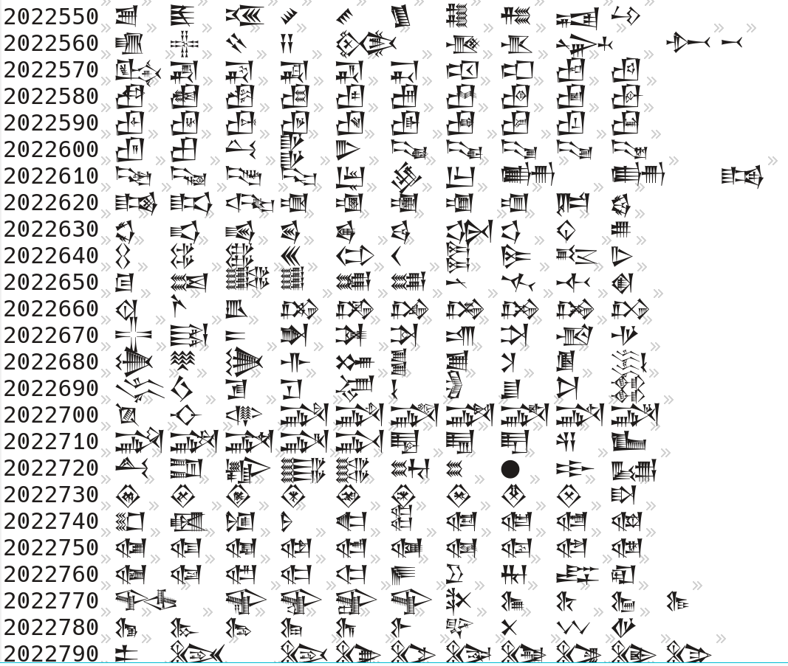

# UTF-8_Maker

一个穷举生成 UTF-8 的小工具。

## UTF-8 是如何编码的？

首先 UTF-8 是**变长**的，也就是说，它可以是 1 个字节(兼容 ASCII)，也可以是多个字节(反正小于等于 8 个字节)，常用的例如汉字，则大部分被编码到了 3 字节范围内，2 字节多是拉丁语，更多则可能是 emoji (我没有具体查了)等等。

那么既然它是变长的，那应该怎么知道它是几个字节呢？方法如下所述

- if 单字节: 首位为 0
- if n 字节: 首位为 1*n+0，其他位的前导为 10

具体看图，更多字节以此类推

字节数|第一个字节|第二个字节|第三个字节|第四个字节
---|---|---|---|---
1|0xxxxxxx|||
2|110xxxxx|10xxxxxx|||
3|1110xxxx|10xxxxxx|10xxxxxx||
4|11110xxx|10xxxxxx|10xxxxxx|10xxxxxx|

## 程序原理和文档

### 原理

暴力穷举。

### 文档

可以看看并修修改改，函数就那么几个，稍微介绍一下

- `getNByteUTF_8` 函数暂时只支持 4 个字节(因为懒得复制粘贴了)
- `get2n` 2^n
- `printToFd` 为什么是 Fd 呢？因为之前想直接输出到文件的，后来想了想，重定向也行啊，就放弃了这个想法，但是函数名就懒得改了(历史遗留原因 2333)
  - 第一个参数是穷举出来的表
  - 第二个参数是每行多少个
  - 第三个参数是是否显示当前序号

## 运行方法

编译一下

```shell
mkdir build && cd build
cmake ..
make -j8
./UTF-8_Maker > utf8.txt
```

## 祝研究愉快！

---

## 顺便

如果有 dalao 知道下列神秘编码(序号为编码)干啥用的，一定要发邮件或者发 issue 给我！不胜感激！

(猜测是古埃及象形文字！说不定可以解开千年游戏法老王隐藏多年的惊天秘密！(大误))

